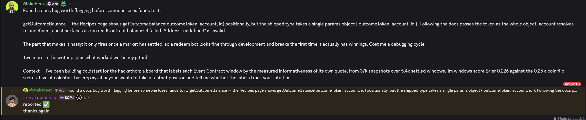
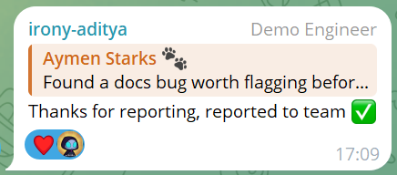

# SDK & documentation feedback

Found while building [`coldstart`](./README.md) against `@somnia-chain/markets-sdk`
0.28.1 on Shannon (50312) and mainnet (5031), 28 Aug – 2 Sep 2026. Ordered by how
much damage each one does.

---

## 1. `getOutcomeBalance` — docs show positional args, the SDK takes an object

**Severity: high.** Fails at redemption time, which is the moment real money is
on the line, and the error names the wrong thing.

The Recipes page ("Check your positions", and again in "Redeem after settlement")
shows:

```ts
const up = await exchange.client.getOutcomeBalance(onchain.outcomeToken, me, onchain.yesId);
```

The shipped type is a single params object:

```ts
export interface GetOutcomeBalanceParams {
  outcomeToken: Address;
  account: Address;
  id: bigint;
}
```

Following the docs passes the token address as the whole params object, so
`account` resolves to `undefined`. TypeScript does not reject it in a loosely
typed call site, and it surfaces at the RPC layer as:

```
rpc readContract balanceOf failed: Address "undefined" is invalid.
```

Nothing in that message points at the argument shape, and it only fires once a
market has settled — so a redeem bot looks healthy through development and breaks
the first time it has winnings to claim. We lost a cycle to it.

**Working form:**

```ts
await exchange.client.getOutcomeBalance({
  outcomeToken: oc.outcomeToken, account: me, id: BigInt(oc.yesId),
});
```

**Status:** reported in the hackathon dev channel on 2 Sep 2026 and confirmed by
the Somnia team, who escalated it internally. PR against the docs offered.




**Suggested fix:** update both Recipes snippets. A runtime guard that throws
`getOutcomeBalance expects { outcomeToken, account, id }` when the first argument
is a string would turn a confusing RPC failure into a one-line fix.

---

## 2. `countBinaryMarkets` saturates silently at 10 000

**Severity: medium.** Returns a plausible number that is not the answer.

On testnet, `countBinaryMarkets({})`, `{ status: "Finalized" }` and
`{ asset: "BTC" }` all return exactly `10000`, while `{ asset: "DECEDO" }`
returns `1`. Mainnet returned `7948`, below the ceiling, so it looks correct
there and hides the behaviour.

We nearly published "10,000 markets" as a venue statistic. Anyone sizing a
backfill or paginating against this value will under-fetch without noticing.

**Suggested fix:** either return the true count, or document the cap and return
something self-evidently truncated — `{ count: 10000, capped: true }`.

---

## 3. Recipes' lot-size guidance no longer matches 0.28.1

**Severity: low**, but it inverts an error-handling decision.

Recipes says an order below one lot "floors to zero, with nothing thrown", and
advises checking for a `0` result and skipping. In 0.28.1 the unified
`createOrder` throws instead. Code written to the documented behaviour silently
does nothing where it should catch; code written to the actual behaviour crashes
if it ever runs against an older pin.

Given the release cadence — nine versions between 6 and 21 Aug, with breaking
floors at 0.23.0 and 0.28.0 — it would help to mark version-sensitive passages
with the version they describe.

---

## What worked well, since bug lists are one-sided

- **Addresses identical across testnet and mainnet via CREATE3.** Removed an
  entire class of config error. More projects should do this.
- **`getBookTops(marketIds[])`** batches every live window into one call. Our
  snapshotter is one indexer round-trip per cycle because of it; 37,000
  snapshots cost almost nothing.
- **The Gotchas page is unusually honest.** The 6-vs-18 decimals warning and the
  note that "testnet looked clean while every mainnet order failed" saved us
  directly — we derive scale from `decimals()` everywhere because of it.
- **`trader.faucet()` minting on demand** with no faucet website is a much better
  developer experience than the usual captcha-and-tweet flow. The contrast with
  sourcing STT for gas is stark.
- **Resolution is publicly auditable** at
  `prd.oracle.somnia.host/questions/{oracleQuestionId}?view=graph`, showing every
  price source, its receipt, and the median. We surface it on every window in the
  board; the docs are right that it is worth surfacing, and we would guess almost
  nobody does.

---

## One product observation

68% of settled mainnet windows and 94% of settled testnet windows never traded at
all, despite a two-sided book resting on every live window at a 2.3–2.9 point
spread. The constraint is not liquidity. It is that nothing tells a prospective
taker which windows are worth having an opinion about — a 1m window scores Brier
0.226 against the 0.25 a coin flip scores, and a 240m window is already decided.
Both are bad first trades, and both look identical in the current interface.

That is what `coldstart` labels, and the measurement behind it is in this repo.
